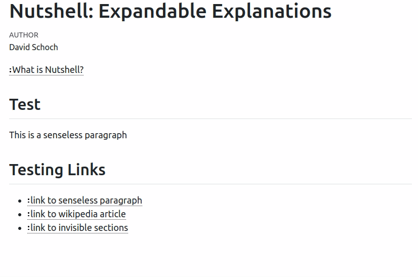

## Nutshell



> Nutshell is a tool to make "expandable explanations" This lets your readers learn only the details they need, just-in-time, always-in-context.   
Unlike links, Nutshell lets you include only the snippet you need, not the whole page. Plus, instead of being lost in a jungle of new tabs, your reader stays on one page, keeping their flow of reading. Even if you interrupt a sentence, Nutshell recaps the sentence afterwards, so your reader never loses context.

You can find more information (and a demo) on the nutshell [webpage](https://ncase.me/nutshell/).

## Install

```sh
quarto install extension schochastics/quarto-nutshell
```

This will install the extension under the `_extensions` subdirectory. If you're using version control, you will want to check in this directory.

## Using
You can use the filter by adding
```
filters:
   - nutshell
```
to your yaml header.

To write a Nutshell snippet, just use headings & paragraphs. To embed a snippet,
just make a link, but with a :colon in the front:

```
[:link](https://en.wikipedia.org/wiki/Nutshell)
```

Note, however, the other webpage needs to also have Nutshell installed, or CORS enabled. If you own the other page, that's not a problem! But if not, you'll have to mirror/copy the other page.

Check out the [interactive demo](https://ncase.me/nutshell/try/) for more help
or head to the
[github repo](https://github.com/ncase/nutshell) to learn about the full
functionality of nutshell.

## Example

Here is the source code for a minimal example: [example.qmd](example.qmd)  
A rendered version can be found [here](https://schochastics.quarto.pub/nutshell-expandable-explanations/).
